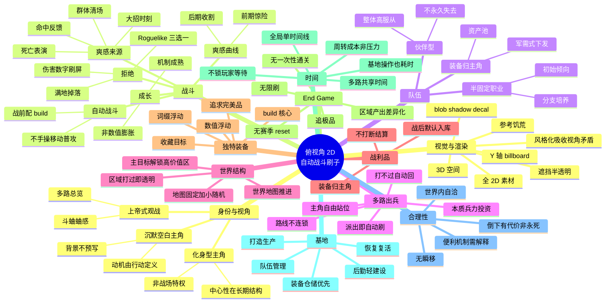

# 游戏设计思维导图

> 来源：[game-design.md](game-design.md) 的浓缩可视化。只保留体现设计取向的结论，不含细节。

```mermaid
mindmap
  root((俯视角 2D<br/>自动战斗刷子))
    身份与视角
      化身型主角
        中心性在长期结构
        非战场特权
      沉默空白主角
        背景不预写
        动机由行动定义
      上帝式观战
        多路总览
        斗蛐蛐感
    战斗
      自动战斗
        战前配 build
        不手操移动普攻
      爽感来源
        命中反馈
        死亡表演
        群体清场
        大招时刻
      爽感曲线
        前期惊险
        后期收割
      成长
        机制成熟
        非数值膨胀
      拒绝
        伤害数字刷屏
        满地掉落
        Roguelike 三选一
    队伍
      伙伴型
        不永久失去
        整体高服从
      半固定职业
        初始倾向
        分支培养
      装备归主角
        资产池
        军需式下发
    多路出兵
      本质兵力投资
      派出即自动刷
      打不过自动回
      路线不连锁
      主角自由站位
    世界结构
      世界地图推进
      区域打过即透明
      地图固定加小随机
      主目标解锁高价值区
    战利品
      战后默认入库
      不打断结算
      装备归主角
    独特装备
      收藏目标
      build 核心
      词缀浮动
      数值浮动
      追求完美品
    End Game
      无限刷
      追极品
      无一次性通关
      无赛季 reset
      区域产出差异化
    时间
      全局单时间线
      多路共享时间
      周转成本非压力
      基地操作也耗时
      不锁玩家等待
    基地
      后勤轻建设
      装备仓储优先
      打造生产
      队伍管理
      恢复复活
    合理性
      世界内自洽
      无瞬移
      倒下有代价非永死
      便利机制需解释
    视觉与渲染
      全 2D 素材
      3D 空间
      Y 轴 billboard
      参考饥荒
      blob shadow decal
      遮挡半透明
      风格化吸收视角矛盾
```
