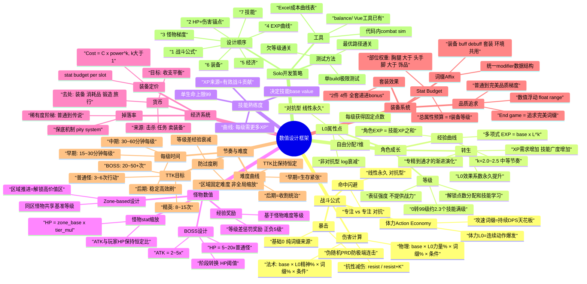

# RPG 数值设计框架 — Percussion 项目适配报告

## Executive Summary

本报告基于 Percussion 项目现有设计文档（game-design.md、attribute-design-principles.md）以及 RPG 数值设计行业最佳实践，为项目提供一个 high-level 数值设计框架。Percussion 是一款俯视自动战斗刷子游戏（Diablo II + 割草 + 挂机），已有 7 维 L0 属性体系 + 转生系统 + 技能熟练度系统的设计哲学方向。本报告梳理的是**需要做哪些数值决策、行业常见做法有哪些、设计顺序是什么**。

> ⚠️ **重要声明**
>
> 本文档中**没有任何公式或数值是已确定的最终结果**。所有出现的具体数字、公式、参数均为**行业案例参考（标注 `⚡例`）**，仅用于说明"这类问题长什么样"，不代表本项目的设计决策。实际数值需要后续逐一讨论确定。

---

## 思维导图



---

## 1. 项目现状：已有的设计方向

`attribute-design-principles.md` 确立了**设计哲学和方向**[^1]，但尚无任何具体数值被最终确定：

| 设计方向（哲学层） | 内容 |
|--------|------|
| L0 属性维度 | 7 维: 力量/精神/生命/法力/专注/意志/体力 |
| 派生分类思路 | 对抗型(线性永久) vs 非对抗型(log/渐近线衰减) |
| 8 条设计原则 | 两类两规则、一致边际收益、无万金油、单责任、对抗/协同网络、主战场必须是对抗型、无职业隔离、等级只是表征 |
| 三层修正器结构 | L0 × 熟练度 × 词缀 |
| 技能熟练度方向 | 有效贡献获取XP, 单生命99上限, 角色XP=∑技能XP |
| 0转99级容量目标 | ≈ 2.3个技能从1到99的总XP |
| 转生方向 | 效果系数提升 + XP需求增加 → 专精→通才 |
| L1 属性列表草案 | 输出/防御/续航 三大类共30+项 |
| 不在L0的东西 | 物防/魔防/暴击/攻速/CDR/移速/回复 → 归词缀 |

**以上所有内容均为设计方向，具体公式、参数、数值全部待定。**

**数值设计需要确定的东西（本文档的讨论范围）：**
- 伤害公式的具体形式和参数
- 经验曲线的具体形状
- 怪物数值缩放规则
- 经济平衡（金币/掉落）
- 装备 stat budget 系统
- 节奏目标（TTK、每级时间）
- 每一个 L0/L1 的具体效果系数

---

## 2. 数值设计需要覆盖的系统（Checklist）

### 🔴 TIER 1 — 必须最先设计（互相依赖的核心）

| # | 系统 | 关键决策 | 状态 |
|---|------|----------|------|
| 1 | **战斗伤害公式** | ATK vs DEF 如何交互; 乘区结构 | 待定 |
| 2 | **HP 数值锚点** | Level 1 玩家/怪物各多少HP | 待定 |
| 3 | **经验曲线** | XP(L) 公式, 每级需多少XP | 待定 |
| 4 | **等级-属性增长** | 每级给几点, 每点效果多大 | 待定 |
| 5 | **怪物难度梯度** | zone 基准 + 怪物tier乘数 | 待定 |
| 6 | **TTK 目标** | 普通怪/精英/BOSS 几秒杀死 | 待定 |

### 🟡 TIER 2 — Tier 1 确定后设计

| # | 系统 | 关键决策 |
|---|------|----------|
| 7 | **装备 stat budget** | ilvl → 总属性预算, 部位权重 |
| 8 | **词缀池 & 数值范围** | 每个词缀 min/max, 品质梯度 |
| 9 | **掉落率 & 稀有度** | 普通/稀有/史诗/传说 概率 |
| 10 | **经济(金币)** | 收入/支出平衡, 定价曲线 |
| 11 | **技能base value曲线** | 熟练度1→99, 技能伤害怎么涨 |
| 12 | **暴击/吸血/灼烧等效果数值** | 词缀效果的数值范围 |

### 🟢 TIER 3 — 后期 Polish

| # | 系统 |
|---|------|
| 13 | 套装效果数值 |
| 14 | 转生系数具体值 |
| 15 | 多路出兵/挂机收益计算 |
| 16 | AI 配置阈值默认值 |
| 17 | 难度曲线微调(zone progression) |

---

## 3. 战斗公式：需要决策的问题 & 行业案例

### 3.1 伤害公式结构

**需要决策**: 乘区如何划分？有几个独立乘区？

> ⚡例 — attribute-design-principles 中提到的方向：
> ```
> final = base(proficiency) × (1 + L0_bonus%) × (1 + affix_bonus%) × condition_mul
> ```
> 这只是结构方向，具体每一项的计算方式和参数都待定。

### 3.2 抗性减伤

**需要决策**: 减伤公式用什么形式？K 值取多少？

> ⚡例 — WoW 渐近线模型[^2]：
> ```
> damage_reduction% = resist / (resist + K)
> ```
> 特点：当 resist = K 时减伤 50%，永远不到 100%。

> ⚡例 — Elden Ring 双层减伤：Defense stat + Equipment Negation% 叠乘。

### 3.3 命中/闪避

**需要决策**: Focus 对抗的具体公式？clamp 范围？

> ⚡例 — 线性差值模型：
> ```
> hit_chance = base_hit + (atk_focus - def_focus) × factor
> clamp(5%, 95%)
> ```

### 3.4 暴击

**需要决策**: 暴击率上限？暴击倍率基准？是否用伪随机？

> ⚡例 — Dota 2 PRD（伪随机分布）[^3]：连续未暴击时暴击概率递增，避免极端连击/连不暴。

---

## 4. 经验与等级：需要决策的问题 & 行业案例

### 4.1 设计方向（来自项目文档，非最终数值）

- 角色 XP = ∑技能熟练度 XP（所有技能等权重）[^1]
- 技能熟练度 XP 来自**有效战斗贡献**（不是"使用次数"）
- 0转99级容量目标 ≈ 2.3 个技能从1到99
- 等级只表征强度，不直接提供战力[^1]

### 4.2 需要决策的问题

- XP 曲线用什么形状？（多项式？指数？分段？）
- 指数 k 取多少？
- 每级时间目标是什么？
- 等级差对经验获取有没有影响？

### 4.3 行业案例

> ⚡例 — 多项式曲线[^4]：
> ```
> xp_required(lv) = base × lv^k     // k=2.0 quadratic, k=3.0 cubic (Pokémon)
> ```

> ⚡例 — 三角数求和（线性增量）：
> ```
> total_xp(L) = base × L × (L+1) / 2
> ```

> ⚡例 — 行业节奏参考[^6]：
> | 游戏类型 | 每级时间 |
> |---------|---------|
> | 短RPG 10-20h | 15-30 分钟 |
> | 中RPG 30-50h | 30-60 分钟 |
> | 长JRPG 60-100h | 1-2 小时 |

---

## 5. 怪物数值：需要决策的问题 & 行业案例

### 5.1 需要决策的问题

- 怪物 stat 按什么维度缩放？（zone level? 怪物tier?）
- 普通/精英/BOSS 之间的倍数关系
- TTK 目标（杀普通怪几秒？被普通怪打几秒？）
- 经验奖励公式，等级差是否影响经验

### 5.2 行业案例

> ⚡例 — Zone-based 设计（WoW/FFXIV）[^3]：
> ```
> monster_stat(zone, tier) = zone_baseline × tier_multiplier
> ```

> ⚡例 — 常见 tier 倍数范围：
> | Tier | HP | ATK | XP |
> |------|-----|-----|-----|
> | 普通 | 1× | 1× | 1× |
> | 精英 | 3-5× | 1.5-2× | 3-5× |
> | BOSS | 10-20× | 2-3× | 10-20× |

> ⚡例 — 恒定 TTK 比原则[^3]：
> 玩家杀普通怪时间 和 怪物杀玩家时间 的比率在所有 zone 保持近似恒定。
> 玩家变强怪也变强，但战斗体验感不变。

> ⚡例 — 等级差经验衰减（WoW grey mob 机制）：
> 玩家超出怪物等级 5+ 级时经验递减，10+ 级时归零。

---

## 6. 经济系统：需要决策的问题 & 行业案例

### 6.1 项目相关背景（来自 game-design.md）

- End game = 无限刷 + 追完美装备（非一次性通关）[^5]
- 装备由主角所有，同伴使用"配发"[^5]
- 独特装备有词缀/数值浮动 + 品质梯度[^5]

### 6.2 需要决策的问题

- 金币来源和去处分别是什么？
- 定价曲线用什么形状？
- 掉落率阶梯怎么定？
- 是否需要保底机制？
- End game 金币是否还有意义？

### 6.3 行业案例

> ⚡例 — 超线性定价[^6]：
> ```
> Cost(power) = C × power^k,  k > 1
> ```
> 每个 power 增量花费不成比例地更多，防止富者通吃。

> ⚡例 — 常见掉落率范围：
> | 品质 | 掉落率 |
> |------|--------|
> | 普通 | 50-100% |
> | 优秀 | 10-30% |
> | 稀有 | 1-5% |
> | 极品 | 0.1-1% |

> ⚡例 — 保底(pity)机制[^3]：连续未出稀有时概率递增，保证极端情况下一定出货。

---

## 7. Solo 开发策略

### 7.1 设计顺序（依赖链）

```
[1] 战斗公式 → [2] 单场景HP/DMG锚点 → [3] 怪物梯度
    → [4] XP曲线 → [5] 经济 → [6] 装备stat budget → [7] 技能数值
```

**黄金法则**: 先定义一个完整场景——"Level 1 玩家 vs 第一个怪物"，所有数值从这里辐射出去[^6]。

### 7.2 工具

- 项目已有 `balance/` 目录（Vue/TS web 计算器）[^7]——可以扩展
- 核心数值用 Excel/Sheets 的 Cost Curve 表管理[^6]
- 战斗模拟可以用 Rust 写 unit test (不需要渲染)

### 7.3 测试方法

| 方法 | 验证什么 |
|------|----------|
| 最优路径通关 | 难度下限（如果这都太简单，就是太简单了） |
| 欠等级通关 | 难度上限（如果这还能过，大多数人都能过） |
| 单build极限 | 平衡性（如果某build碾压一切，有问题） |
| Combat Sim 表格 | Level 1/10/50/99 的 TTK 是否恒定 |

---

## 8. 下一步：需要逐一讨论确定的事项

1. **战斗公式具体形式**: 乘区结构、抗性公式形式
2. **Level 1 锚点场景**: 玩家 HP/DPS vs 第一个怪物 → 确定 TTK 感觉
3. **XP 曲线形状选择**: 多项式/指数/分段？
4. **L0 每点效果**: "1 力量 = 物理伤害 +X%"，X 取多少？
5. **怪物 tier 倍数**: 普通/精英/BOSS 具体比例
6. **经济框架**: 金币来源/去处/定价曲线

---

## 说明

- 本文档中所有 `⚡例` 标记的内容均为**行业参考案例**，来源标注在脚注中
- 这些案例用于理解"这类问题通常怎么解决"，不代表本项目应该照搬
- 实际数值需要结合项目的 feel（自动战斗/挂机/割草/多路出兵）逐一讨论确定

---

## Footnotes

[^1]: `doc/attribute-design-principles.md` — Percussion 项目属性设计原则文档，定义了 L0/L1 属性体系、8条设计原则、三层修正器结构

[^2]: WoW armor mitigation formula: `Damage Reduction = Armor / (Armor + 400 + 85 × AttackerLevel)` — Ian Schreiber, Game Balance Concepts Level 4; Elden Ring wiki (eldenring.wiki.fextralife.com/Calculating+Damage)

[^3]: RPG numerical design industry practices — synthesized from: Ian Schreiber "Game Balance Concepts" (gamebalanceconcepts.wordpress.com, 2010), Wikipedia "Game Balance" article, Elden Ring/Dark Souls wiki formulas

[^4]: Pokémon EXP curves use L³ (cubic); polynomial k=2.0~2.5 is standard for medium-paced RPGs — Ian Schreiber Game Balance Concepts Level 3

[^5]: `doc/game-design.md` v0.3 — Percussion 游戏设计文档，定义了核心循环、节奏、世界结构、装备系统

[^6]: Ian Schreiber, "Game Balance Concepts" Level 3 (Cost Curves) & Level 10 (Economics) — gamebalanceconcepts.wordpress.com; Jeff Vogel (jeff-vogel.blogspot.com) — solo RPG dev methodology

[^7]: `balance/` directory in Percussion project root — existing Vue/TypeScript web-based balance calculator tool
