# 技能系统说明书

> 本文档说明 Percussion 当前技能子系统的**结构、数据流、扩展**。  
> 代码位置：[crates/percussion/src/unit/skill.rs](../crates/percussion/src/unit/skill.rs)、
> [crates/percussion/src/unit/skill_hitbox.rs](../crates/percussion/src/unit/skill_hitbox.rs)、
> [crates/percussion/src/unit/hitbox.rs](../crates/percussion/src/unit/hitbox.rs)、
> [crates/percussion/src/unit/damage_calc.rs](../crates/percussion/src/unit/damage_calc.rs)、
> [crates/percussion/src/unit/hit_triggers.rs](../crates/percussion/src/unit/hit_triggers.rs)、
> [crates/percussion/src/unit/burning.rs](../crates/percussion/src/unit/burning.rs)、
> [crates/percussion/src/unit/hurtbox.rs](../crates/percussion/src/unit/hurtbox.rs)、
> [crates/percussion/src/unit/player/animation.rs](../crates/percussion/src/unit/player/animation.rs)


---

## 1. 一句话定位

> **一招 = 从「我想放它」到「目标扣完血」的一条完整流水线。**
> 这条流水线被切成若干互不知道彼此的小模块，靠 ECS message 接力跑通。

---

## 2. 全局鸟瞰图

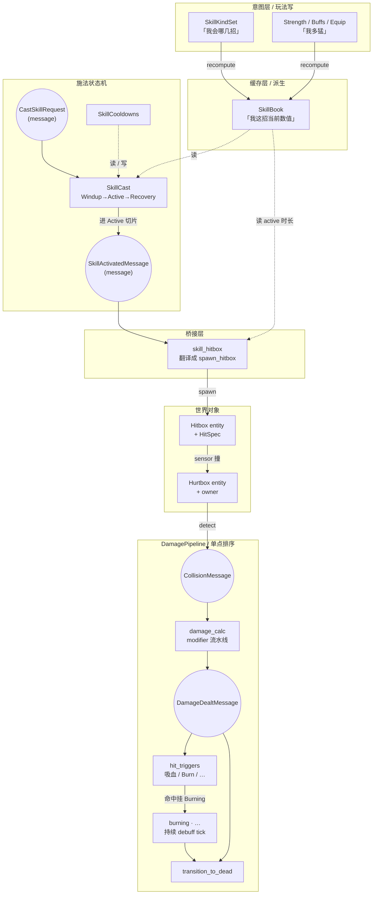

四块大色：

| 层 | 谁能写 | 谁来读 | 关键类型 |
|---|---|---|---|
| **Intent** | 玩法 / spawn 代码 | recompute | `SkillKindSet`, `Strength` |
| **Cache** | recompute（独占） | cast / bridge / 动画 | `SkillBook`, `Skill` |
| **State machine** | 输入 / AI（请求层）+ cast tick | bridge / 动画 | `SkillCast`, `SkillCooldowns` |
| **World** | bridge（spawn）+ physics（撞）+ pipeline（结算） | 自己 | `Hitbox`, `Hurtbox`, `HitSpec` |

---

## 3. 核心类型一张表

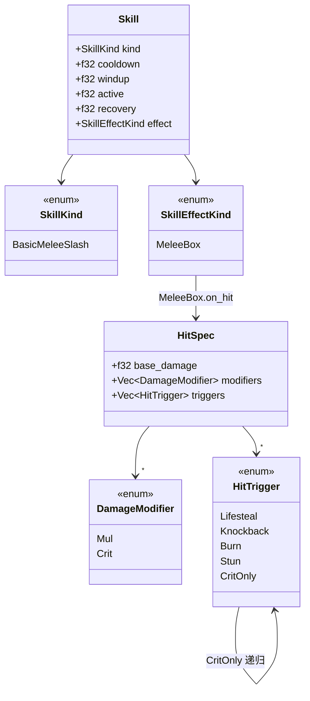

**enum 变体的实际字段**（mermaid classDiagram 不能嵌套 `{}`，列在这里）：

| Enum | 变体 | 字段 |
|---|---|---|
| `SkillEffectKind` | `MeleeBox` | `reach, swing, height, offset: Vec2, on_hit: HitSpec` |
| `DamageModifier` | `Mul` | `(f32)` |
| `DamageModifier` | `Crit` | `chance, mul` |
| `HitTrigger` | `Lifesteal` | `ratio` |
| `HitTrigger` | `Knockback` | `force` |
| `HitTrigger` | `Burn` | `duration, dps` |
| `HitTrigger` | `Stun` | `duration` |
| `HitTrigger` | `CritOnly` | `Box<HitTrigger>`（递归包装：仅暴击触发内层） |

**关键命名约定**（来自 [skill.rs](../crates/percussion/src/unit/skill.rs) 顶部）：

- `SkillKind` —— **身份标签**（"哪一招"），不带数值，可 `Copy`。
- `Skill` —— **运行时实例**（"这招当前数值"），不可 `Copy`（内含 `Vec<DamageModifier>`）。
- `SkillKindSet` —— intent，"会哪几种招"。
- `SkillBook` —— cache，"每招的当前 `Skill`"。

---

## 4. Intent → Cache：`recompute_skill_book`

> 玩法层写 intent / source，cache 自动跟上。**不允许直接写 `SkillBook`。**

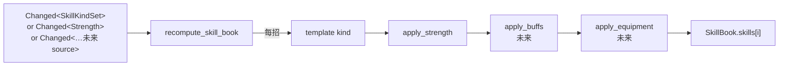

数学顺序：`template` → `apply_strength` → `apply_buffs` → `apply_equipment` → …  
约定：**先放大、再修正** —— caster-side 的 `Mul` `prepend` 进 `HitSpec::modifiers` 链头，这样命中端的 modifier 看到的是「已经被力量放大过」的伤害。

加新 source 的标准动作：

1. 在 `recompute_skill_book` 的 query 元组里加 `Option<&NewSource>`；
2. 在 `Or<>` filter 里加 `Changed<NewSource>`；
3. 在 `compute_skill` 里加一个 `apply_new_source` 调用。

**其他模块零改动。**

---

## 5. 一招的生命周期

### 5.1 状态机：`SkillCast.phase`

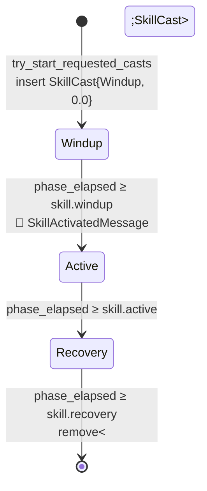

特征：

- `SkillCast` **存在与否** 等价于"是否在施法中"。`Option<&SkillCast>` 上的 `is_some()` 是 commit-to-swing 的唯一来源。
- `SkillActivatedMessage` **只在 Windup→Active 跨越那一帧** 发一次；hitbox 由它触发 spawn。
- 进入 Recovery 不发消息 —— hitbox 自己用 `HitboxLifetime` 倒计时 despawn（lifetime = `skill.active`），跟状态机时间天然对齐。
- 当前**不可打断**：cast 期间 `try_start_requested_casts` 直接跳过新请求，没有排队。打断 / 队列等 `CancelSkillRequest` 出现再说。

### 5.2 端到端：从按 J 到血条扣血

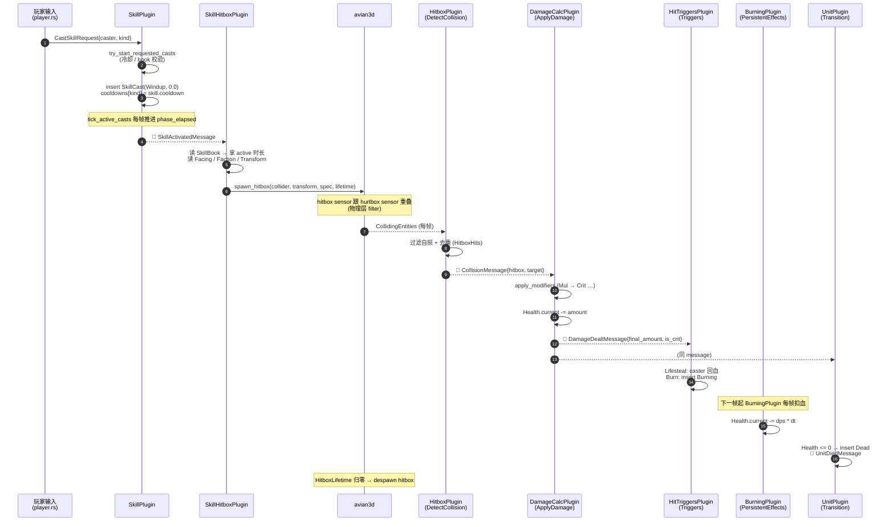

---

## 6. `DamagePipeline` —— 跨模块顺序的单点定义

> 没人用 `.before()/.after()` 互相指 —— 顺序写在一处。

[unit.rs](../crates/percussion/src/unit.rs) 里定义了一个 `SystemSet` 枚举，5 段串成 `.chain()`：

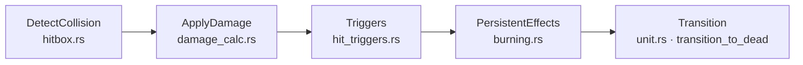

| Set | 谁来填 | 做什么 | 产物 |
|---|---|---|---|
| `DetectCollision` | `HitboxPlugin` | 扫 `CollidingEntities`，去重 + 过滤自损 | `CollisionMessage` |
| `ApplyDamage` | `DamageCalcPlugin` | 跑 modifier 流水线、扣 `Health` | `DamageDealtMessage` |
| `Triggers` | `HitTriggersPlugin` | per-hit 副作用（吸血 / Burn / …） | 修 `Health` / 挂 `Burning` |
| `PersistentEffects` | `BurningPlugin` (未来：中毒 / 流血) | 现存 debuff 每帧 tick | 修 `Health` |
| `Transition` | `UnitPlugin::transition_to_dead` | 扫 `Health ≤ 0` → 挂 `Dead`、发 `UnitDiedMessage` | `Dead` marker |

**关键设计点**：

- `Triggers` 在 `ApplyDamage` **之后**：因为 `CritOnly` / `Lifesteal` 要看 `is_crit` 和 `final_amount`，这俩只有 modifier 全跑完才知道。
- `PersistentEffects` 在 `Triggers` **之后**：这帧才被点燃的目标，本帧不扣 DoT（`Burning` 组件还没 flush 上去，PersistentEffects 的 query 看不到）—— 想要的行为。
- `Transition` 在最后：本帧所有扣血来源都结算完才统一判死。

---

## 7. 命中规格 `HitSpec` —— modifier 与 trigger 的分工

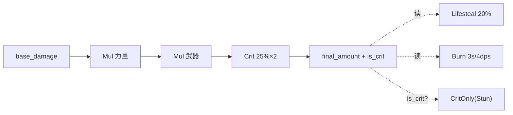

| 维度 | `modifiers` | `triggers` |
|---|---|---|
| 影响什么 | 伤害**数字** | 数字之外的世界状态 |
| 顺序敏感？ | **是**（串行） | 否（互相独立） |
| 何时跑 | `ApplyDamage` | `Triggers`（先看 `is_crit`） |
| 何时定值 | spawn hitbox 之前 | spawn hitbox 之前 |

### 两条铁律

1. **caster-side 一切烧在 spawn 那一刻**：bridge 在调 `spawn_hitbox` 之前，把 caster 的力量 / 武器 / 全局 buff 全部折算成具体的 `Mul` 值塞进 `HitSpec::modifiers`。命中结算时不再回查 caster —— caster 死了 / 走了 / 状态变了都不影响已经飞出去的攻击。
   - 当前实现：caster-side 修正在 **`recompute_skill_book`** 阶段就烧进 `SkillBook` 里的 `HitSpec` 了；bridge 只 `clone()` 一份丢给 hitbox，不读任何 caster stat 组件。  
   - 好处：caster-side 数值知识集中在 recompute 一处，bridge 退化成纯翻译。
2. **target-side 修正在 `ApplyDamage` 里现算**：armor / 抗性 / vulnerability 这些来自被打者的修正写在 `damage_calc.rs` 里、跑 modifier 流水线之后。当前还没有，未来加。

---

## 8. 桥接层：`skill_hitbox`

> `skill` 不知道 `hitbox`，`hitbox` 不知道 `skill`。中间这一行字一定要有人写。

[skill_hitbox.rs](../crates/percussion/src/unit/skill_hitbox.rs) 干**纯翻译**：

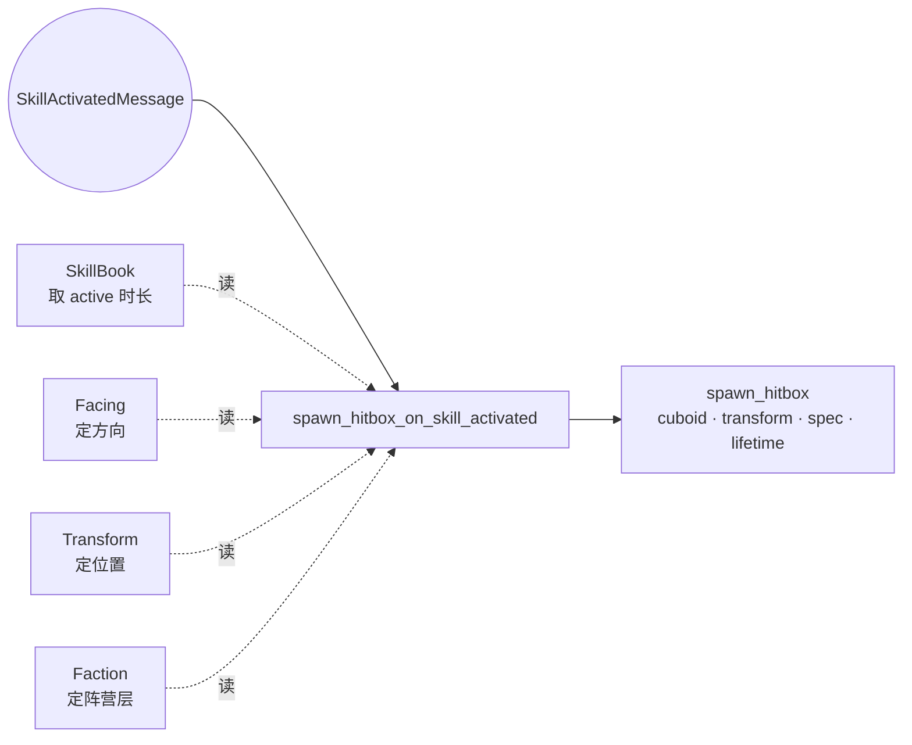

### 几何约定（俯视图，caster 朝 +X）

```text
        +Z ↑
            │             ┌──────────────┐ ← center.z + swing/2
            │             │              │
   ── ● ────┼─────────────┤   MeleeBox   ├──→ +X (facing)
      P     │             │      ●       │
            │             └──────────────┘ ← center.z - swing/2
            │             ↑      ↑       ↑
            │ ←─ off.x ──→│   center      │
            │             ←──── reach ───→
```

- `reach` —— **打多远**（剑长 / 体术伸臂）
- `swing` —— **横扫多宽**（横扫 vs 直刺）
- `height` —— **罩多高**（罩整人 vs 扫腿）
- `offset` —— caster→box 中心位移（**caster-relative**：`x` 沿 facing，`y` 沿 facing 左手侧）

转世界坐标：只看 `Facing` 翻 `x / z` 符号（`Cuboid` 对称、不旋转 collider）。

### 未来同源桥接

`SkillActivatedMessage` 不是 hitbox 独占。视觉特效、音效、UI cooldown 飞屏都该订阅，每个一个**独立桥接模块**：`skill_vfx.rs` / `skill_audio.rs` / `skill_ui.rs`。**不要塞进 `skill_hitbox.rs`**。

---

## 9. Hitbox / Hurtbox —— 两个独立 entity

> `Hitbox` = 「我这一刀的判定范围」；`Hurtbox` = 「我能被打中的范围」。两个 sensor entity，分别挂在攻击者 / 被攻击者旁边。

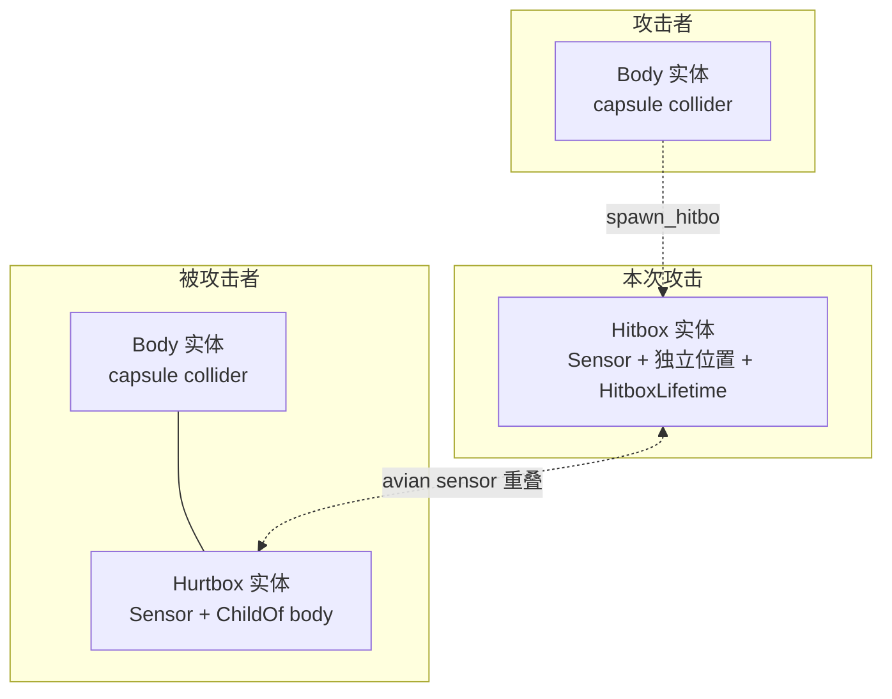

**为什么 Hitbox 是独立 entity（不 `ChildOf` caster）**：

- **形状跟 body 解耦**：一刀盒子 1.4m × 1.2m，body capsule R=0.5m，两个东西。
- **多块共存**：一招可能甩 3 个判定（连段、范围+中心），各自管自己的 lifetime / hits。
- **生命周期跟 caster 解耦**：投射物出膛后跟着自己走；近战 swing 是"出招瞬间快照位置 + 短 lifetime"。
- **caster 死了不影响已飞出的攻击**（搭配「caster-side 烧在 spawn」约定）。

**为什么 Hurtbox 单独 entity（`ChildOf` body 但不共用 collider）**：

- 受击形状想跟着 sprite 变（弯腰 / 倒地受击面小），body 形状不能跟着变（推挤会抽风）。
- 多块 hurtbox（头 / 身 / 腿，不同倍率）；body 永远只有一个。
- hitbox 应该**穿过** body 直接判定到 hurtbox —— 不能让 body 把 hitbox 弹开。

**物理层过滤**（[`crate::physics_layers`]）：`PlayerHitbox` / `EnemyHitbox` 只 filter `Hurtbox`，反之亦然。物理层一行配置消除全部不该撞的对。

### 去重：`HitboxHits.already_hit`

一块持续几帧的 hitbox 跟同一个 hurtbox 每帧都重叠 —— 如果不去重，一刀变 N 倍伤害。  
解决：每块 hitbox 上挂 `HitboxHits { already_hit: Vec<Entity> }`，记**被命中 unit**（不是 hurtbox 自己 —— 一个 unit 可能挂多块 hurtbox 但应该算同一人）。

---

## 10. 动画对齐 —— 三段线性划帧

> 攻击动画是 `SkillCast` 的**派生表达**，不是按键的直接产物。

[player/animation.rs](../crates/percussion/src/unit/player/animation.rs) 的 `paced_frame_offset` 是个**纯函数**，跟 ECS 完全解耦：

```mermaid
gantt
    title 攻击动画三段划帧（windup=0.10 / active=0.05 / recovery=0.15）
    dateFormat X
    axisFormat %s

    section sprite frames
    pre  frames 11-12         :done, pre,   0, 100
    active frames 13-14       :crit, act, 100, 150
    post frame 15             :done, post, 150, 300

    section Skill phases
    Windup                    :done, w, 0, 100
    Active 📨 spawn hitbox    :crit, a, 100, 150
    Recovery                  :done, r, 150, 300
```

**保证**：声明的 active 帧子区间（`Some(13..15)`）**精确播放在** `[windup, windup+active)` 这个时间窗里 —— 跟 `SkillActivatedMessage` 触发 spawn hitbox 的时刻完美对齐。

**抽象层级**：

- 函数签名只吃裸 `f32`（`pre_secs`, `active_secs`, `post_secs`），不依赖 `Skill` 类型。
- Attack 从 `Skill` 取（`windup / active / recovery`）。
- Jump 将来从 jump 状态机取（`prep / airborne / landing`），复用同一函数。

`PlayerAction::active_frames()`：

| 动作 | active 帧的语义 | 对齐的逻辑窗 |
|---|---|---|
| `Attack` | hitbox 存在、判定能命中 | `Skill::active` |
| `Jump` | 真正腾空、重力起作用 | `Jump::airborne`（未接） |
| `Idle / Run` | —— 没有内部阶段 | `None`（按常量 fps 循环） |

---

## 11. 死亡 / 复活

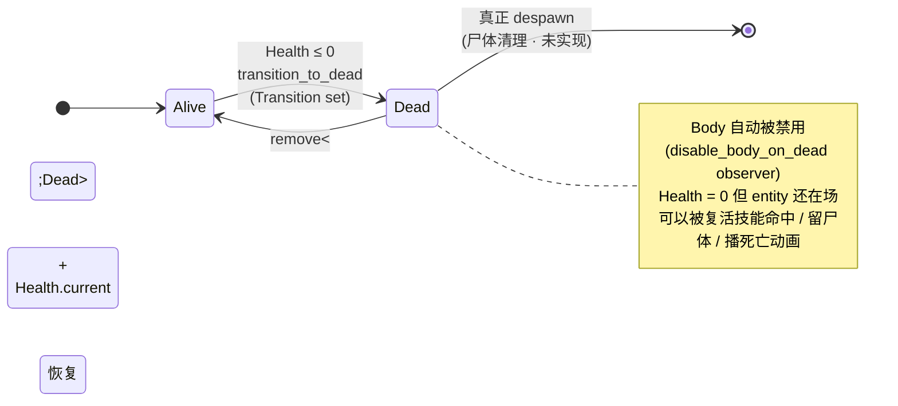

- **死 ≠ despawn**：`Dead` 是 marker，entity 还在世界里。  
- **Body 自动禁用**：observer `disable_body_on_dead` 在 `Dead` 挂上的瞬间往 entity insert `ColliderDisabled + RigidBodyDisabled` —— 尸体不挡路、不被推。
- **复活**：`commands.entity(e).remove::<Dead>()` + `Health` 恢复，`reenable_body_on_revive` observer 自动取消禁用。
- **全局约定**：所有 unit-level system 默认加 `Without<Dead>` filter。

---

## 12. 模块依赖图（plugin 视角）

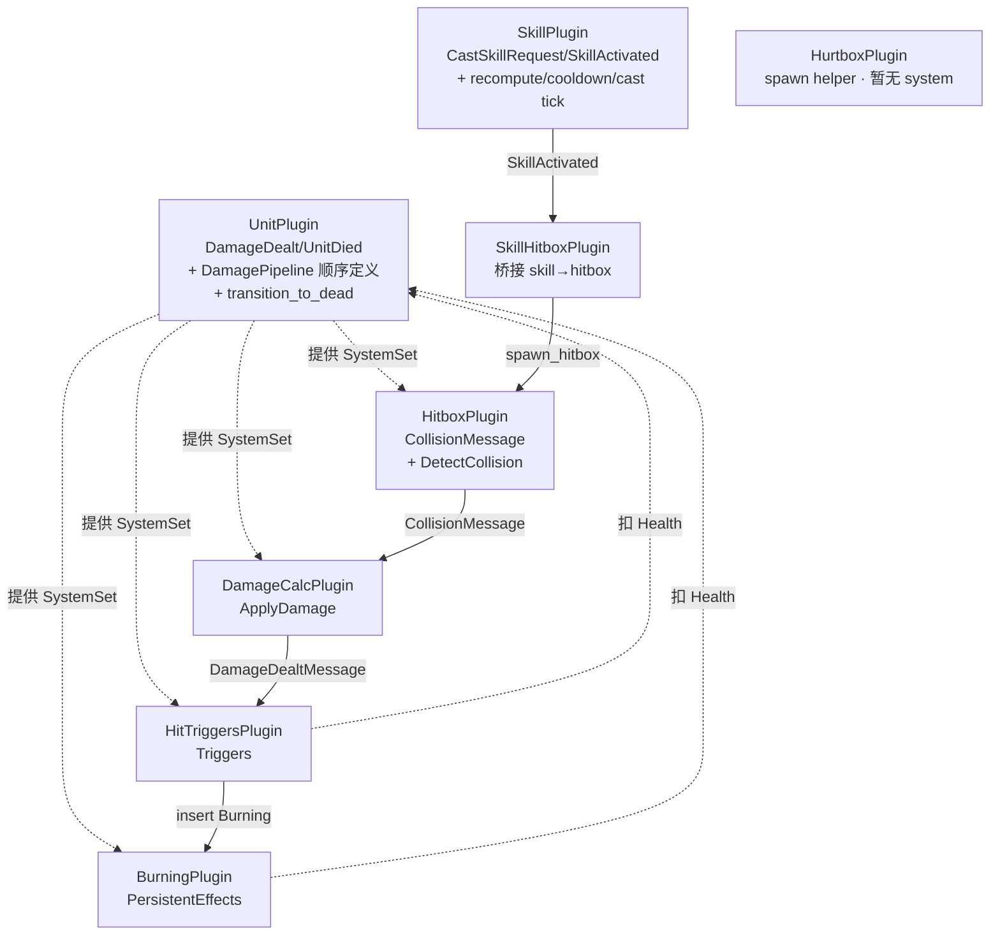

**单向依赖**：箭头不回。`skill` 不知道 `hitbox`；`hitbox` 不知道 `skill`；`damage_calc` 不知道 `Burning`，只发 `DamageDealtMessage`。

---

## 13. 扩展配方

### 13.1 加一种新招（如 `BasicRangedShot`）

1. `SkillKind::BasicRangedShot` —— 加一个 enum 变体；
2. `template(BasicRangedShot)` —— 写默认数值；
3. `SkillEffectKind` —— 如果需要新形状（投射物），加一个变体；
4. `skill_hitbox.rs` 的 `match` —— 加新变体的翻译逻辑（或者拆个新桥接 `skill_projectile.rs`）；
5. 玩法层：`SkillKindSet::new([..., BasicRangedShot])`；
6. 输入层：把对应按键映射到 `CastSkillRequest { kind: BasicRangedShot }`；
7. 动画 `decide_player_action` 的 `match cast.kind` —— 加新 arm 选对应动作（编译器逼着补，exhaustive）。

### 13.2 加一种新的 `DamageModifier`（如 `Add(f32)` 加法基础伤害）

1. `DamageModifier::Add(f32)` —— 加变体；
2. `damage_calc::apply_modifiers` 的 `match` —— 加 arm；
3. 给单元测试加一两条覆盖。

新 modifier 自动跑 `ApplyDamage` 阶段，零调度改动。

### 13.3 加一种新的 `HitTrigger`（如 `Heal { ratio }` 给 target 回血）

1. `HitTrigger::Heal { ratio }` —— 加变体；
2. `hit_triggers::execute_trigger` 的 `match` —— 加 arm；
3. （如果包装条件不止 `CritOnly`）可加新包装 variant。

### 13.4 加一种新的 caster source（如 `WeaponMul`）

1. 加 component `WeaponMul(f32)`；
2. `recompute_skill_book` query 加 `Option<&WeaponMul>` + `Changed<WeaponMul>` 入 `Or<>` filter；
3. `compute_skill` 里加 `apply_weapon_mul`；
4. 顺序：放在 `apply_strength` 之后（武器倍率作用于已被力量放大的伤害）。

### 13.5 加一种持续 debuff（如 `Poisoned`）

1. 复制 [burning.rs](../crates/percussion/src/unit/burning.rs) 的结构（最简洁的范本）：组件 + tick system + plugin；
2. plugin 把 tick system 注册到 `DamagePipeline::PersistentEffects`；
3. `HitTrigger::Poison { ... }` —— 命中触发 insert 该组件。

---

## 14. 当前简化与未来扩展

| 当前简化 | 未来要做 |
|---|---|
| 不可打断 / 不可排队（cast 中忽略新请求） | `CancelSkillRequest` + 队列 |
| 单一 `Strength` caster source | `WeaponMul` / `Buffs` / `Equipped` |
| 命中只能扣血 + 7 种固定 trigger | `Heal` / `Cleanse` / `Polymorph` … |
| 友军判定只过滤 `owner==owner`（自损） | `Faction` 同侧 filter（多 enemy 互相不误伤） |
| Hurtbox 形状跟 body 一致 | 头 / 身 / 腿分块倍率 |
| Channeling（持续 cast）没有 | 单独一组 phase（`Channel { tick_interval }`） |
| `Knockback` / `Stun` 占位符 | impulse 子系统 + `Stunned` 组件 |
| caster RNG 用全局 `fastrand` | `Resource<Rng>` 走 deterministic replay |

---

## 15. 一行总结

> **意图（KindSet）→ 缓存（Book）→ 状态机（Cast）→ 消息（Activated）→ 桥接（Hitbox）→ 物理（Sensor）→ 流水线（DamagePipeline）→ 结算（Dealt）→ 触发器 / DoT → 死亡转移。**
>
> 模块之间靠 message + SystemSet 解耦，每段都能独立测试和换实现。
