# 技能系统说明书

> 本文档说明 Percussion 当前技能子系统的**结构、数据流、扩展点**。
> 代码位置（按数据流顺序）：
> - 意图层：[skill.rs](../crates/percussion/src/unit/skill.rs)
> - 桥接层：[skill_activation.rs](../crates/percussion/src/unit/skill_activation.rs)
> - 命中产源：[strike.rs](../crates/percussion/src/unit/strike.rs) / [projectile.rs](../crates/percussion/src/projectile.rs)
> - 命中数据：[hit_data.rs](../crates/percussion/src/unit/hit_data.rs)
> - 结算流水线：[damage_calc.rs](../crates/percussion/src/unit/damage_calc.rs) / [hit_effects.rs](../crates/percussion/src/unit/hit_effects.rs) / [burning.rs](../crates/percussion/src/unit/burning.rs)
> - 死亡转移 + pipeline 顺序定义：[unit.rs](../crates/percussion/src/unit.rs)
> - 动画对齐：[player/animation.rs](../crates/percussion/src/unit/player/animation.rs)

---

## 1. 一句话定位

> **一招 = 从「我想放它」到「目标扣完血」的一条完整流水线。**
> 这条流水线被切成一串互不知道彼此的小模块，靠 ECS message + `SystemSet` 链接力跑通。

---

## 章节目录

1. 一句话定位（上）
2. 全局鸟瞰图
3. 核心类型一张表
4. Intent → Cache：`recompute_skill_book`
5. 一招的生命周期：`SkillCast` 状态机 + 端到端序列图
6. 命中产源：`Strike` vs `Projectile`
7. `Strike` 子系统：`AttackEffect` 三类 + `CandidateSet` 候选筛子 + 几何
8. `DamagePipeline` —— 跨模块顺序的单点定义
9. 命中规格 `HitSpec` —— modifier 与 effect 的分工
10. 桥接层：`skill_activation`
11. 动画对齐：三段线性划帧
12. 死亡 / 复活 / `Body` 生命周期
13. 模块依赖图
14. 扩展配方
15. 当前简化与未来扩展
16. 一行总结

---

## 2. 全局鸟瞰图

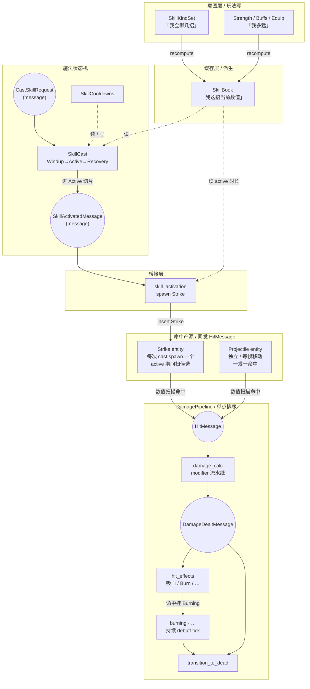

六块大色：

| 层 | 谁能写 | 谁来读 | 关键类型 |
|---|---|---|---|
| **Intent** | 玩法 / spawn 代码 | recompute | `SkillKindSet`, `Strength` |
| **Cache** | recompute（独占） | cast / bridge / 动画 | `SkillBook`, `Skill` |
| **State machine** | 输入 / AI（请求层）+ cast tick | bridge / 动画 | `SkillCast`, `SkillCooldowns` |
| **Bridge** | `skill_activation` 独占（监听 message） | — | — |
| **命中产源** | bridge spawn / 投射物 spawn | `resolve_strikes` / `detect_projectile_hits` | `Strike`, `Projectile`, `HitSpec` |
| **Pipeline** | 各 plugin 注册 system 到 set | 自身按 `chain()` 顺序 | `HitMessage`, `DamageDealtMessage` |

**与旧版的主要差别**（如果你看过旧版本 doc）：
- 没有 `Hitbox` / `Hurtbox` 独立 sensor entity 了，命中检测完全数值化，跟 avian 物理解耦。
- 桥接模块叫 `skill_activation` 不叫 `skill_hitbox`。
- 命中消息叫 `HitMessage` 不叫 `CollisionMessage`，且**自包含 `HitSpec`**——消息发出后产源 entity 可立即消失，下游仍能完整结算。
- 多了一类命中产源：[`Projectile`](../crates/percussion/src/projectile.rs)（投射物），跟 `Strike` 同发 `HitMessage`，下游一视同仁。

---

## 3. 核心类型一张表

按"意图 → 缓存 → 状态机 → 命中产源 → 命中数据 → 结算消息"6 组排：

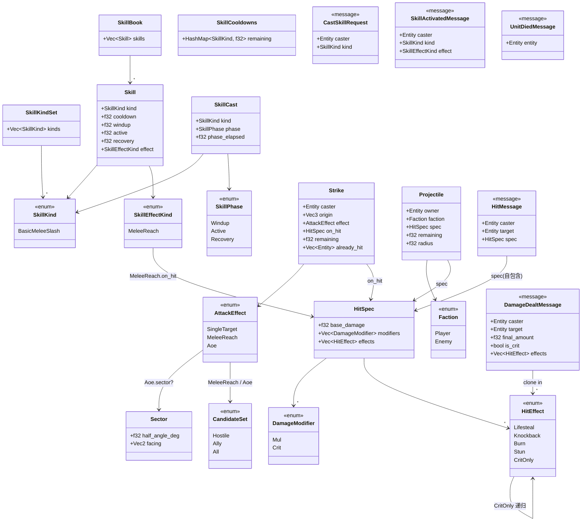

**enum 变体的实际字段**（mermaid classDiagram 不能嵌套 `{}`，列在这里）：

| Enum | 变体 | 字段 |
|---|---|---|
| `SkillEffectKind` | `MeleeReach` | `reach, offset: Vec2, on_hit: HitSpec` |
| `AttackEffect` | `SingleTarget` | `target, reach, hits_air` |
| `AttackEffect` | `MeleeReach` | `reach, hits_air, candidates: CandidateSet` |
| `AttackEffect` | `Aoe` | `radius, sector: Option<Sector>, hits_air, candidates: CandidateSet` |
| `CandidateSet` | `Hostile(Faction)` | 扫与给定 faction 不同阵营的 unit |
| `CandidateSet` | `Ally(Faction)` | 扫与给定 faction 相同阵营的 unit |
| `CandidateSet` | `All` | 扫所有 unit（友 + 敌都打） |
| `DamageModifier` | `Mul` | `(f32)` |
| `DamageModifier` | `Crit` | `chance, mul` |
| `HitEffect` | `Lifesteal` | `ratio` |
| `HitEffect` | `Knockback` | `force`（占位符，待 impulse 子系统） |
| `HitEffect` | `Burn` | `duration, dps` |
| `HitEffect` | `Stun` | `duration`（占位符，待 `Stunned` 组件） |
| `HitEffect` | `CritOnly` | `Box<HitEffect>`（递归包装：仅暴击触发内层） |

**关键命名约定**（来自 [skill.rs](../crates/percussion/src/unit/skill.rs) 顶部）：

- `SkillKind` —— **身份标签**（"哪一招"），不带数值，可 `Copy`。
- `Skill` —— **运行时实例**（"这招当前数值"），不可 `Copy`（内含 `Vec<DamageModifier>`）。
- `SkillKindSet` —— intent，"会哪几种招"。
- `SkillBook` —— cache，"每招的当前 `Skill`"。

**`SkillEffectKind` vs `AttackEffect` 区分**：

- `SkillEffectKind` 在 **意图层**（[skill.rs](../crates/percussion/src/unit/skill.rs)）—— 用 caster-relative 语义（`reach` + `offset.x`）声明"这一刀挥多远"。
- `AttackEffect` 在 **命中产源层**（[strike.rs](../crates/percussion/src/unit/strike.rs)）—— 已经翻译成几何参数（`radius` / `sector` / `target`），不再带 facing 相对的语义。
- 桥接层 [`skill_activation`](../crates/percussion/src/unit/skill_activation.rs) 负责前者翻后者。

---

## 4. Intent → Cache：`recompute_skill_book`

> 玩法层写 intent / source，cache 自动跟上。**不允许直接写 `SkillBook`。**

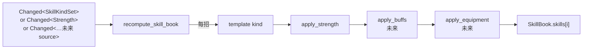

**数学顺序**：`template` → `apply_strength` → `apply_buffs` → `apply_equipment` → …
**约定：先放大、再修正** —— caster-side 的 [`DamageModifier::Mul`] `prepend` 进 [`HitSpec::modifiers`] 链头，让命中端的 modifier（target armor / 命中环境 buff）作用在已被力量放大的中间值上。

加新 source 的标准动作（[skill.rs](../crates/percussion/src/unit/skill.rs) `recompute_skill_book` doc 里写的）：

1. 在 `recompute_skill_book` 的 query 元组里加 `Option<&NewSource>`；
2. 在 `Or<>` filter 里加 `Changed<NewSource>`；
3. 在 `compute_skill` 里加一个 `apply_new_source` 调用。

**其他模块零改动** —— `SkillBook` 是 cache 类型，cast / bridge / 动画都只读它，不会去关心数值是从哪几个 source 折算出来的。

**当前实现**：只接 [`Strength`](../crates/percussion/src/unit.rs) 这一项，作为"caster-side 烧在 spawn 那一刻"原则的最小可工作验证。未来要加的 source（武器 / 全局 buff / 装备）都按上面三步走，不动其他模块。

---

## 5. 一招的生命周期

### 5.1 状态机：`SkillCast.phase`

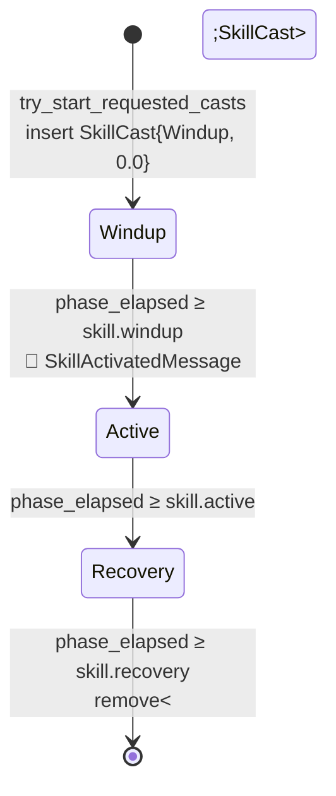

特征：

- `SkillCast` **存在与否** 等价于"是否在施法中"。`Option<&SkillCast>` 上的 `is_some()` 是 commit-to-swing 的唯一来源。
- [`SkillActivatedMessage`](../crates/percussion/src/unit/skill.rs) **只在 Windup→Active 跨越那一帧** 发一次；命中产源由它触发 spawn（见 §10 桥接）。
- 进入 Recovery **不发消息** —— `Strike` 是独立 entity，靠 `Strike.remaining` 字段倒计时（= `skill.active`）走完后由 [`resolve_strikes`](../crates/percussion/src/unit/strike.rs) 听同一个 system 里 `despawn` 掉，跟状态机时间天然对齐。
- 当前 **不可打断**：cast 期间 `try_start_requested_casts` 直接跳过新请求，没有排队。打断 / 队列等 `CancelSkillRequest` 出现再说。

### 5.2 端到端：从按 J 到血条扣血

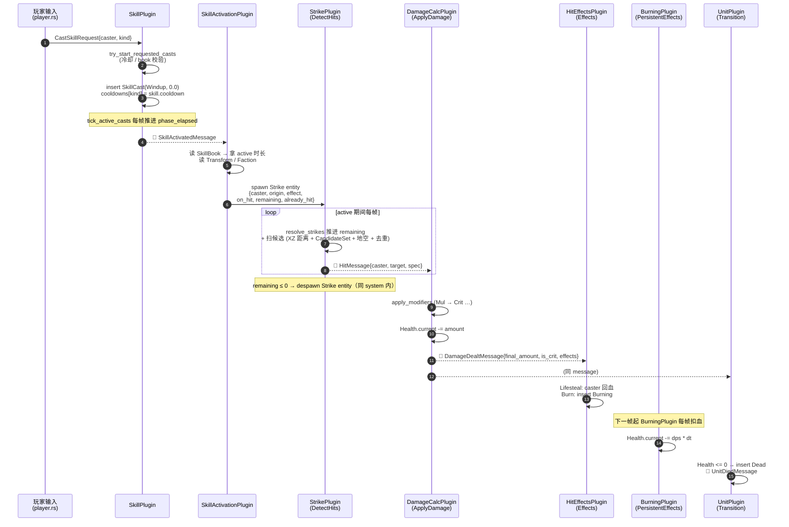

跟旧版（基于 avian sensor 的）相比的关键不同：
- 没有 `spawn_hitbox` —— `Strike` 是**独立 entity**，每次 cast 由桥接层 `commands.spawn(Strike { caster: ev.caster, .. })` 创建一个新的，跟 active 同寿。
- 没有 avian `CollidingEntities` 触发循环 —— `resolve_strikes` 每帧主动扫候选数学算距离。
- 没有"hitbox lifetime tick"独立 system —— lifetime 字段在 `Strike.remaining`，跟扫描同一个 `resolve_strikes` 一起 tick 进去。

---

## 6. 命中产源：`Strike` vs `Projectile`

> 两类"会算出命中的东西"，下游不区分（都发 `HitMessage`），但产源行为差异大，所以拆成两个类型 + 两个 system。

### 6.1 为什么不复用同一种

直觉上"近战 swing"和"投射物"都是"一段时间里有一块判定区域去打人"，看起来能塞进同一个抽象。但**生命周期 + origin 行为**正交：

| 维度 | 近战 swing（`Strike`） | 投射物（`Projectile`） |
|---|---|---|
| **origin** | spawn 时**快照**，整段 active 不变 | 每帧跟着 `Transform.translation` 走 |
| **存活方式** | 倒计时（= `skill.active`）走完 despawn | 倒计时或撞到敌人或撞墙 despawn |
| **命中次数** | active 期间可多帧；per-target 去重（`already_hit`） | **一发一命中**，命中即 despawn |
| **候选选择** | `AttackEffect::{SingleTarget, MeleeReach, Aoe}` 三种；筛子 `CandidateSet`（Hostile / Ally / All） | 当前直接 `Faction != target` 二元过滤（未来可换 `CandidateSet`） |
| **几何** | 圆形 / 扇形（取决于 effect） | 球形（中心 = `Transform`，半径 = `radius`） |
| **来源 entity 引用字段** | `caster` | `owner` |

把两者塞进同一个类型会污染 `Strike` 的"origin 快照不变"约定（投射物天天动），或污染 `Projectile` 的"一发一命中"约定（近战要扫多帧）。各自的 system 也得分支处理，复杂度增加而非减少。所以**保持两个类型 + 两个 system**，靠 `HitMessage` 这个共用产物把它们粘到同一条下游流水线上。

### 6.2 但下游不知道谁打出来的

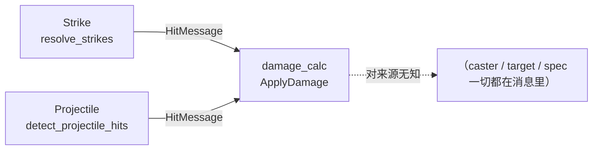

- 两个 system 都在 [`DamagePipeline::DetectHits`](../crates/percussion/src/unit.rs) set，时序对等。
- 都发完全一样格式的 [`HitMessage`](../crates/percussion/src/unit/hit_data.rs)：`{ caster, target, spec: HitSpec }`。
- 下游 [`damage_calc`](../crates/percussion/src/unit/damage_calc.rs) / [`hit_effects`](../crates/percussion/src/unit/hit_effects.rs) **不查任何来源 entity** —— `spec` 已经 clone 进消息，对来源（strike / projectile / 未来 DoT 虚拟来源 / 陷阱）一视同仁。

### 6.3 来源 entity 立刻消失也行

`HitMessage.spec` 是**自包含 `HitSpec`** —— 命中那一帧 clone 进消息后，产源 entity 即使下一帧（甚至同一帧后段）被 despawn，下游仍能完整结算。具体两个表现：

- **Strike**：active 阶段最后一帧扫到命中，`remaining -= dt` 后 ≤ 0，同 system 内 despawn 自己。`HitMessage` 已经发出，`damage_calc` 在下个 set 收到时不需要回查 strike entity。
- **Projectile**：命中合法敌人 → 发 `HitMessage` → 立刻 despawn（一发一命中约定）。同样下游不依赖 projectile 存活。

这条约定让产源 system 写 despawn 不用"先发消息再延一帧"之类的小心翼翼，逻辑直白。

---

## 7. `Strike` 子系统：`AttackEffect` 三类 + `CandidateSet` 候选筛子

> [strike.rs](../crates/percussion/src/unit/strike.rs) 的"扫候选 → 距离过滤 → 角度过滤（扇形）→ 地空过滤 → 去重"统一流程。差别只在**候选集合**和**最近一个 vs 全部**两个维度。

### 7.1 三类 `AttackEffect` 对比

| | `SingleTarget` | `MeleeReach` | `Aoe` |
|---|---|---|---|
| **候选选择** | cast 时已锁定 `target: Entity` | 候选由 [`CandidateSet`] 决定 | 候选由 [`CandidateSet`] 决定 |
| **几何** | 检查那一个 target 的 dist 是否 ≤ `reach + hurt_radius` | 候选里选 **dist 最近的一个** | 候选里 **全部命中**（不挑最近） |
| **形状** | 半径 = `reach` 的点-距 | 圆形（半径 = `reach`） | 圆形 或 圆扇形（`Option<Sector>`） |
| **active 期内多次命中？** | 否（首次命中后跳过判定） | 否（同上） | 是（per-target 去重，每个 target 最多一次） |
| **faction 过滤** | **不查 faction** —— 上游已锁 entity | 由 [`CandidateSet`] 决定 | 由 [`CandidateSet`] 决定 |
| **典型用例** | 治疗 / 嗡讽控制反发 / 自伤 / 友军伤害 | 普攻 / 短挥砍 | 群体技 / 圣光新星 / 地刺 |

**为什么 `SingleTarget` 不查 faction**：上游（玩家鼠标 / AI 选目标 / 法术参数）已经决定打谁，攻击系统不应该再二次拦截。这条路径**支持的合法用例**：治疗队友、被嗡讽的 caster 攻击友军、友军伤害、自伤。反之 `MeleeReach` / `Aoe` 是"扫一片选合规者"，没有 entity 锁定，必须靠 `CandidateSet` 筛选。

### 7.2 几何示意（俯视图，caster 朝 facing→）

```text
MeleeReach（圆形，最近一个）          Aoe with sector（圆扇形，全部）

       . . .                           . . .
     .       .     ← reach           .       .
    .    A    .                     .  A      .
    .   ●—————————→ facing          .   ●——————————→ facing
    .         .   候选 best         .         .
     .   B   .                       .   B   .   候选 A,B 都命中
       . . .                           . . .   (角度内)
                                       
                                       angle ←2 × half_angle_deg→


SingleTarget（锁定 target）            候选筛子 CandidateSet

                                     Hostile(Player)  → 扫 Enemy
            ●—————————→ T (locked)   Ally(Player)     → 扫 Player
        caster   reach               All              → 扫 任何 unit
        
                                     admits(c) 决定 c 是否进入下一步过滤
```

### 7.3 `CandidateSet` 候选筛子

```rust
pub enum CandidateSet {
    Hostile(Faction), // 只扫与给定 faction 不同阵营
    Ally(Faction),    // 只扫与给定 faction 相同阵营
    All,              // 全扫
}

impl CandidateSet {
    pub fn admits(&self, candidate: Faction) -> bool { ... }
}
```

**为什么不直接在 effect 上写 `faction: Faction`**（旧设计）：写死 "同阵营 = 不打"，群治 / 双效 AoE（一招既伤敌又治己）/ 友军伤害 / 全员混伤 都无法表达。`CandidateSet` 用三个显式 variant 让"这击在几何扫描时考虑谁"成为 effect 的显式参数 —— 调用方构造时强制选，没有默认值意味着没有暗设定。

**bridge 当前行为**（[`skill_activation`](../crates/percussion/src/unit/skill_activation.rs)）：所有近战 spawn `CandidateSet::Hostile(*faction)` —— 行为跟旧设计完全等价，但底层数据结构已经能表达 `Ally` / `All` 了。未来 SkillBook 带"群治 / 群友增益"语义时，bridge 这一处 `Hostile` 改读 effect 自带的 `CandidateSet` 字段即可，strike 几何层不需要任何改动。

### 7.4 2D XZ 距离约定

Percussion 是 top-down 自动战斗，Y 高度差几乎只在跳跃时短暂出现。**命中判定只看 XZ 平面距离，Y 忽略** —— 跳起来的玩家仍能砍到地面上的怪（否则违反 ARPG 直觉）。所有 `dist(...)` 都是 `sqrt((dx)² + (dz)²)`。

平方比避免开方：`d2 = dx² + dz²`，阈值 `t = reach + hurt_radius`，命中条件 `d2 ≤ t²`。

### 7.5 为什么不用 avian sensor

以前试过用 collider+sensor 的几何 entity 表达受击，靠 avian 扫重叠 → `CollisionStarted`。限制：

- 调度、顺序、生命周期都卸给物理引擎；spawn / despawn / sensor 事件跨帧顺序难控
- 调试不直观（要打开 wireframe 才能看 sensor 形状）
- 命中过滤要走物理层位运算（`PlayerHitbox` / `EnemyHitbox` / `Hurtbox` 等），跟"友军伤害 / 双效 AoE"这种逻辑层语义错位

改成纯数值之后：

- 没有 collider、不进 avian 物理层、不发 sensor 事件
- 命中由 `resolve_strikes` system 用 2D XZ 平面的点 + 半径数学公式算
- 单位"被打中"由 [`HurtRadius`](../crates/percussion/src/unit.rs) 数值 + 中心点 (`Transform.translation`) 表达
- avian 只剩"占体积、推挤、撞墙"。**damage 完全脱钩**于 avian，跑在 Bevy schedule 内，时序可预测、跟 avian API 解耦

详见 [physics_layers.rs](../crates/percussion/src/physics_layers.rs) —— 物理层枚举里已经**没有** `Hitbox` / `Hurtbox` 层。

### 7.6 `resolve_strikes` 内部流程

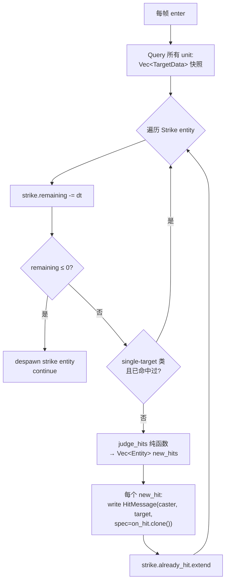

**关键点**：

- **候选快照一次性 collect**：百级 unit 下几 KB，几帧 ns。换来 helper 不背 `Query` invariant lifetime 包袱、可单测、判定逻辑跟 ECS 解耦。
- **`judge_hits` 是纯函数**：输入 `(&Strike, &[TargetData])`，输出 `Vec<Entity>`。内部按 effect 派发到 `judge_single_target` / `judge_nearest_in_circle` / `judge_aoe`。
- **`is_valid_candidate` 共享过滤**：`CandidateSet::admits` + `already_hit.contains` + `hits_air` 检查，由 `judge_nearest_in_circle` / `judge_aoe` 共用。`judge_single_target` 不查阵营（见 §7.1 表）但其他过滤一致。
- **per-cast 去重**：`already_hit` 是 `Strike` 字段，跟着 entity 一起 despawn —— 不需要全局去重表。

---

## 8. `DamagePipeline` —— 跨模块顺序的单点定义

> 没人用 `.before()/.after()` 互相指 —— 顺序写在一处。

[unit.rs](../crates/percussion/src/unit.rs) 里定义了一个 `SystemSet` 枚举，5 段串成 `.chain()`：

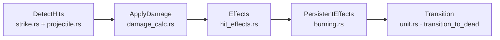

| Set | 谁来填 | 做什么 | 产物 |
|---|---|---|---|
| `DetectHits` | `StrikePlugin` (`resolve_strikes`) + `ProjectilePlugin` (`detect_projectile_hits`) | 扫候选 + 数学算距离 | [`HitMessage`](../crates/percussion/src/unit/hit_data.rs) |
| `ApplyDamage` | `DamageCalcPlugin` (`calc_damage_pipeline`) | 跑 modifier 流水线、扣 `Health` | [`DamageDealtMessage`](../crates/percussion/src/unit.rs) |
| `Effects` | `HitEffectsPlugin` (`dispatch_hit_effects`) | per-hit 副作用（吸血 / Burn / …） | 修 `Health` / 挂 `Burning` |
| `PersistentEffects` | `BurningPlugin` (未来：中毒 / 流血) | 现存 debuff 每帧 tick | 修 `Health` |
| `Transition` | `UnitPlugin::transition_to_dead` | 扫 `Health ≤ 0` → 挂 `Dead`、发 `UnitDiedMessage` | `Dead` marker |

**关键设计点**：

- **`Effects` 在 `ApplyDamage` 之后**：因为 [`HitEffect::CritOnly`](../crates/percussion/src/unit/hit_data.rs) / `Lifesteal` 要看 `is_crit` 和 `final_amount`，这俩只有 modifier 全跑完才知道。
- **`PersistentEffects` 在 `Effects` 之后**：这帧才被点燃的目标，本帧不扣 DoT（`Burning` 组件还没 flush 上去，PersistentEffects 的 query 看不到）—— 想要的行为。
- **`Transition` 在最后**：本帧所有扣血来源（直接命中 + DoT）都结算完才统一判死。`Without<Dead>` filter 这个全局约定也指望这条：上游 system 用 filter 把"本帧已经死了的"剔除，让"打死了之后再撞不应该再扣"成立。
- **顺序优先于并发**：单帧整条 < 1ms，5 个 set 串行不是瓶颈。换来调度图简单 + 出 bug 容易复现。

**加新阶段** = 在 `DamagePipeline` enum 里加变体 + `.chain()` 元组里放到正确位置 + 对应 plugin 把 system 塞进新 set。其他 plugin 零改动。

---

## 9. `HitSpec` —— modifier vs effect 二分 + 顺序烧入

> 命中后果拆成两条 Vec：影响数字的 vs 不影响数字的。

[`HitSpec`](../crates/percussion/src/unit/hit_data.rs) 的三个字段：

```rust
pub struct HitSpec {
    pub base_damage: f32,
    pub modifiers: Vec<DamageModifier>, // 影响伤害数字 / 顺序敏感
    pub effects: Vec<HitEffect>,        // 不影响伤害数字 / 互相独立
}
```

### 9.1 为什么拆开

| | `DamageModifier` | `HitEffect` |
|---|---|---|
| **修改对象** | `amount` / `is_crit` 中间值 | `Health` / 挂 component / 推位移 |
| **顺序敏感** | 是（`Crit{mul:2}` 看到的是之前 `Mul(1.5)` 的结果） | 否（吸血 / 点燃 / 击退互不依赖） |
| **谁消费** | [`damage_calc::apply_modifiers`] | [`hit_effects::dispatch_hit_effects`] |
| **跑在哪个 set** | `ApplyDamage` | `Effects` |
| **典型成员** | `Mul(1.5)`, `Crit{chance:0.3, mul:2.0}` | `Lifesteal{ratio}`, `Burn{dur,dps}`, `CritOnly(...)` |

**关键点**：副作用要看 modifier 跑完后的两个产物 —— `final_amount`（吸血回多少）+ `is_crit`（`CritOnly` 是否触发）。所以**先 `ApplyDamage` 再 `Effects`** 顺序在 §8 已经定。

### 9.2 modifier 顺序：先放大、再修正、最后暴击

`apply_modifiers` 是纯函数，按 Vec 顺序串行 apply：

```text
amount = base_damage
for m in modifiers:
    match m:
        Mul(k)            => amount *= k
        Crit{chance, mul} => if roll() < chance: amount *= mul; is_crit = true
```

每条 `Crit` 独立 roll；任一成功即标 `is_crit = true`；多 `Crit` 倍率连乘。

**约定顺序**（[`recompute_skill_book`] / bridge 拼装时维持）：

1. **caster-side `Mul`**（Strength / 武器倍率 / 全局增伤 buff）
2. **effect 自带 modifier**（技能特性 / 装备词条）
3. **`Crit`**

理由：`Crit` 看到的应该是"装备加成都算完之后的中间值"。`recompute_skill_book` 用 `prepend` 把 caster-side modifier 塞到链头，保证顺序。

### 9.3 caster-side 烧入：spawn 那一刻就 freeze

约定：bridge（[`skill_activation`] / 投射物 spawn / 未来陷阱）在 **spawn 之前**把 caster 当时的状态读出来，折算成具体 `DamageModifier::Mul` 值塞进 `HitSpec.modifiers`。命中那一刻不再回查 caster。

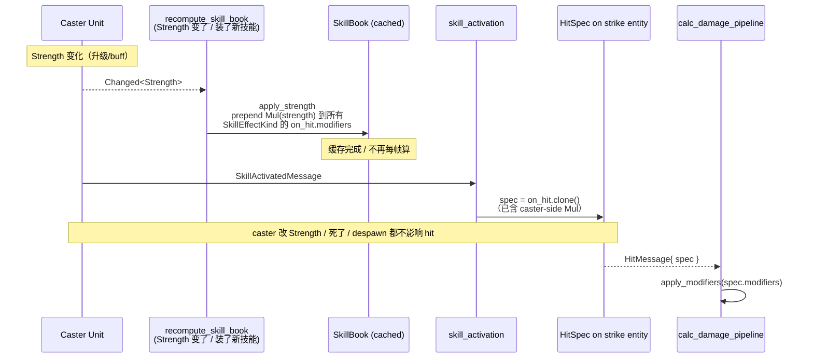

**好处**：

- 命中结算不要 caster 还活着（射出去的箭、已 despawn 的 strike entity 都能算）。
- 世界状态简洁 —— 不需要"找 caster → 找他身上的 Strength → 找装备表"链式查询。
- 同一个技能，不同 caster spawn 出的 strike 数值不同 —— 由 spawn 时 freeze 实现，自然区分。

**代价**：

- caster 状态变化后已飞出去的攻击**不感知**（射出去的箭不会突然变更狠）。这是有意为之的语义。
- 加新 caster-side modifier（暴击词条 / 元素抗性穿透）= 改 `recompute_skill_book`，不是改 `damage_calc`。

### 9.4 target-side modifier 还没接

[`calc_damage_pipeline`] 函数体里有这条占位注释：

```rust
// (target-side 修正未来在这里接：armor reduction / vulnerability / 抗性…)
```

未来加 `Armor` / `Vulnerable(elemental)` 之类组件时，从 caster-side modifier 跑完的中间结果 `amount` 上再 apply 一次 —— 不需要把 target-side modifier 塞进 `HitSpec.modifiers`（那是 caster-side 已 freeze 的链）。

### 9.5 测试友好：roll 注入

`apply_modifiers` 把 RNG 显式作为参数：

```rust
pub fn apply_modifiers(
    base: f32,
    modifiers: &[DamageModifier],
    roll: &mut impl FnMut() -> f32,
) -> (f32, bool)
```

- 生产传 `&mut || fastrand::f32()`。
- 测试传 `&mut || 0.0`（必暴击）/ `&mut || 1.0`（必不暴）/ 闭包包数列（确定序列）。
- 未来要做 deterministic replay / 联机同步时，把 `fastrand` 换成从 `Resource` 取的 RNG，纯函数本身不动。

---

## 10. 桥接层 [`skill_activation`]：技能 → `Strike` 翻译

> [`super::skill`] 子系统只管"技能放出来了"（发 [`SkillActivatedMessage`]），不知道命中怎么做。[`super::strike`] 子系统只接受"已经摆好的 `Strike` entity"，不知道 skill 是啥。中间这一层做翻译。

### 10.1 单 system 直白结构

整个 [`skill_activation.rs`](../crates/percussion/src/unit/skill_activation.rs) 只有一个 system [`spawn_strike_on_skill_activated`]：

```text
for ev in MessageReader<SkillActivatedMessage>:
    q_caster.get(ev.caster) → (transform, _facing, faction, book)
    book.get(ev.kind)       → &SkillRuntime
    match ev.effect:
        SkillEffectKind::MeleeReach { reach, offset, on_hit }
            => commands.spawn(Strike { ... })
```

- 输入：`SkillActivatedMessage { caster, kind, effect: SkillEffectKind }`
- 输出：spawn 一个新 `Strike` entity，`remaining = skill.active`（跟 active 阶段同寿）
- 副作用：**不**修改 caster 任何组件、**不**读 caster Strength（已在 SkillBook 烧好）
- 异常路径：`q_caster.get` / `book.get` 任一失败 → `warn!` + 跳过（按设计不应发生，但要看见）

### 10.2 `MeleeReach` 几何翻译：直线 reach → 圆形 reach

旧设计 [`SkillEffectKind::MeleeReach`]（技能层）描述的是"沿 facing 朝前一段直线"：

```text
        caster ●—————————→ facing
               |         |
               | offset.x|  reach
               |←——————→ |←————→|
                         box 中心
```

新 [`AttackEffect::MeleeReach`]（攻击层）是 WC3 / Diablo 风格的圆形近战射程：

```text
            . . .
          .       .
         .         .
        .  caster  .         radius = offset.x + reach/2
         .   ●     .         "能够到多远"
          .       .
            . . .
```

翻译规则：

| 旧字段 | 含义 | 新字段 | 推导 |
|---|---|---|---|
| `offset: Vec2` | hitbox 中心距 caster 偏移（沿 facing） | （不再用） | 圆形 360° 无前后概念 |
| `reach: f32` | hitbox 直径（沿 facing 方向尺寸） | `radius` | `radius = offset.x + reach / 2.0`（直线最远端到 caster 中心） |
| `facing` | caster 朝向 | （不再读） | 圆形对称 |

代码原文一行：

```rust
let melee_reach = offset.x + reach / 2.0;
```

**约定**：caster 半径内最近敌方 unit 命中。背后的敌人也算 —— WC3 单位攻击的典型做法（普攻不挑前后）。要"必须正面对敌"等以后加 `AttackEffect::MeleeSector { reach, sector }`。

### 10.3 `_facing` 字段保留 / 未来扇形锥度

system 的 query 里读了 `&Facing` 但当前未用（`_facing` 前缀）：

```rust
let Ok((caster_tf, _facing, faction, book)) = q_caster.get(ev.caster) else { ... };
```

保留这个字段是为了**未来加扇形 / 朝向相关 effect 时不用改 query schema**。如果加 `AttackEffect::MeleeSector { reach, sector: Sector { facing: Vec2, half_angle_deg: f32 } }`，桥接层只需读 `Facing` 转 Vec2 塞进 `Sector::facing`，没有人需要改 query。

### 10.4 candidates 当前一律 `Hostile(faction)`

```rust
candidates: CandidateSet::Hostile(*faction),
```

跟旧设计行为完全等价（普攻只打敌方）。`CandidateSet` 三个 variant（Hostile / Ally / All）已经在底层准备好了，但 SkillBook 现在不带 candidates 字段 —— bridge 一律取 `Hostile`。未来 SkillBook 带"群治 / 群友增益 / 全员混伤"语义时：

1. `SkillEffectKind` 加 `candidates: CandidateSet` 字段；
2. bridge 改一行 `candidates: ev.effect.candidates.clone()`；
3. 其他模块（strike / damage_calc）零改动。

### 10.5 `origin` 在 spawn 那一刻 snapshot

```rust
commands.spawn(Strike {
    origin: caster_tf.translation,  // ← 当前帧 caster 位置
    remaining: skill.active,
    ...
});
```

origin freeze 是"凝固一击"约定的实现：active 期间 caster 跑了 / 死了 / despawn 了都不影响判定位置（strike entity 是独立的）。投射物正好相反 —— origin = `Transform.translation`，每帧自动跟着 projectile entity 自身位移走。

### 10.6 加新 `SkillEffectKind` 配方

bridge 是唯一需要新增 `match` arm 的地方：

```rust
match &ev.effect {
    SkillEffectKind::MeleeReach { ... } => commands.spawn(Strike { ... }),
    SkillEffectKind::ProjectileShot { speed, radius, on_hit }
        => commands.spawn(Projectile { ... }),  // 未来
    SkillEffectKind::AoeAt { radius, on_hit, sector }
        => commands.spawn(Strike { effect: AttackEffect::Aoe { ... }, ... }),
}
```

技能层负责"技能定义参数"（reach / speed / radius），bridge 负责"翻译成攻击层数据"，攻击层只看 `AttackEffect`。三层关注点不重叠。

---

## 11. 动画对齐：`paced_frame_offset` 三段划帧

> 攻击动画的"接触帧"必须恰好播在 `SkillPhase::Active` 段里 —— 这样视觉 / 逻辑 / 物理判定看起来在同一时刻发生。

### 11.1 问题

动画 sprite sheet 上一段 Attack 动作（[`PlayerAction::Attack`](../crates/percussion/src/unit/player/animation.rs)）是固定的几帧（例 sheet 帧 11..16，共 5 帧）。其中"挥到目标"的接触帧是中段（[`active_frames()`](../crates/percussion/src/unit/player/animation.rs) 声明，例 `13..15`）。

技能层面 [`Skill { windup, active, recovery }`](../crates/percussion/src/unit/skill.rs) 三段时长**与 sprite 总长无关** —— 武器变重就 windup 长、攻速 buff 就整体短，但 sprite 还是这 5 帧。

要让"sprite 接触帧"恰好播在 "`SkillPhase::Active` 段"内，不能"5 帧均匀铺到 windup+active+recovery 上"，必须**三段线性划帧**。

### 11.2 时间映射

```mermaid
gantt
    title elapsed → sprite frame 三段映射
    dateFormat X
    axisFormat %s
    section Skill phase
    Windup : 0, 200
    Active : 200, 400
    Recovery : 400, 700
    section Sprite frames
    pre (frame 11-12)    :done, 0, 200
    active (frame 13-14) :crit, 200, 400
    post (frame 15)      :done, 400, 700
```

```text
elapsed:    0 ────── windup ─────── +active ────── +recovery
sprite:     [pre 抬手]       [active 接触]        [post 收招]
                            ↑ 恰好对齐 SkillPhase::Active ↑
```

三段各自的局部 fps **独立**：

- pre 段：在 `skill.windup` 秒内线性播完 `[range.start, active_frames.start)` 那几帧；
- active 段：在 `skill.active` 秒内线性播完 `active_frames` 区间；
- post 段：在 `skill.recovery` 秒内线性播完 `[active_frames.end, range.end)` 剩下的帧。

这样：sprite "接触帧" 区间的两端**恰好对齐** `SkillPhase::Active` 段的两端。`SkillActivatedMessage`（在 Windup→Active 切换时发）→ Strike spawn → 玩家看到的 sprite 帧"砍下去那一帧" —— 三者视觉时刻一致。

### 11.3 `active_frames` 声明

每个 `PlayerAction` 静态声明自己的接触帧子区间（如果有的话）：

```rust
const fn active_frames(self) -> Option<Range<usize>> {
    match self {
        Self::Attack => Some(13..15),
        Self::Idle | Self::Run | Self::Jump => None,
    }
}
```

- `Idle` / `Run` / `Jump` 返回 `None` —— 走老的"按常量 fps 推进 / 循环 / 一次性"路径。
- `Attack` 返回 `Some(...)` —— 触发 `paced_frame_offset` 三段划帧。
- 未来新攻击动作（重砍 / 连击）加一行 `match` arm 就行。

### 11.4 为什么从 `Skill` 取时长而不是从 sprite 反推

技能数值（武器倍率、攻速 buff、不同 caster 的 strength）是**动画时长的 single source of truth**。sprite sheet 上的 5 帧只是视觉素材，跟数值无关。

- caster 装了新武器 → `Skill { windup: 0.5, active: 0.3, recovery: 0.4 }` 变了 → 动画自动同步拉长（5 帧仍然均匀铺到三段里）。
- 攻速 buff = `Mul` skill 三段 → 动画自动加速。
- 同一个 sprite 复用到不同 caster（boss 重型挥砍 vs 玩家轻砍） → 帧序列一样、节奏不同。

`tick_player_animation` 系统从 `SkillCast` + `SkillBook` 里读出当前技能的三段时长，传给 `paced_frame_offset` —— 没有"动画时长 / 技能时长"双 source 同步问题。

---

## 12. 死亡 / 复活 / `Body` 二态

> "死 ≠ despawn"。`Dead` marker 控制"参不参与战斗"，[`Body`] 配合 observer 让"尸体不挡路、复活恢复挡路"零额外 if-check。

### 12.1 `Dead` marker = 全局通行证

[`Dead`](../crates/percussion/src/unit.rs) 是个空 marker component：

```rust
#[derive(Component, Default, Debug)]
pub struct Dead;
```

约定：

- `Health.current <= 0.0` **不等于 dead** —— 这是"血掉光了"的瞬时事实。
- [`transition_to_dead`](../crates/percussion/src/unit.rs) 在 `DamagePipeline::Transition` 阶段扫 `Health.current <= 0 + Without<Dead>` → 给 entity 挂 `Dead`、发 [`UnitDiedMessage`]。
- 所有 unit-level system 在 query 上加 `Without<Dead>` —— 上游不需要自己写 health check。

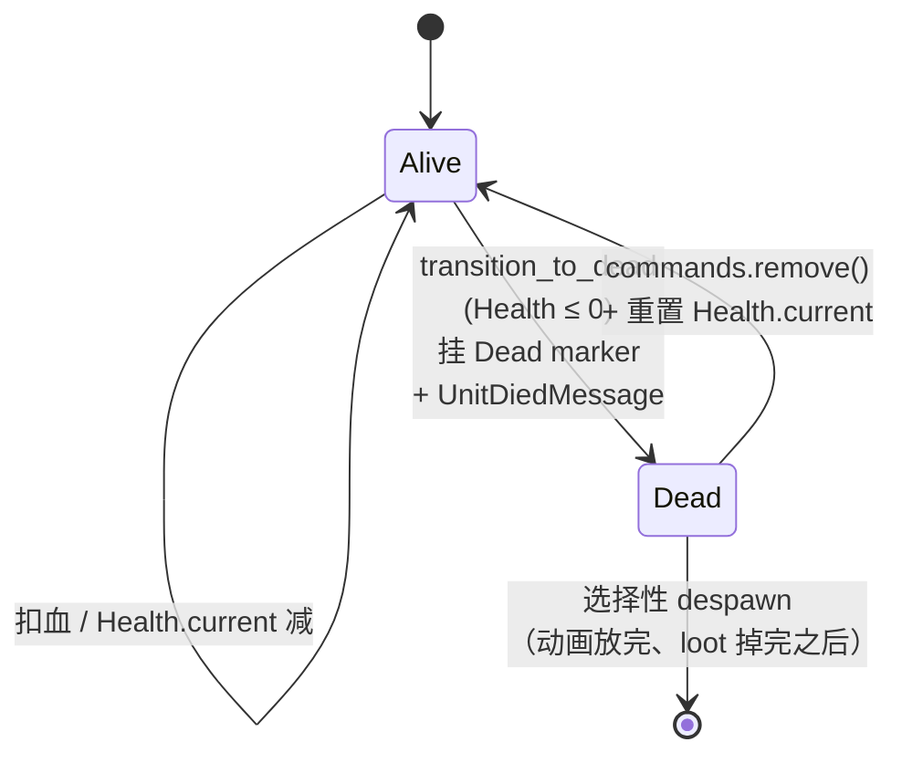

**好处**：

- 动画 / AI / 命中判定 / 技能起手都靠 `Without<Dead>` filter 拒绝 —— 不需要写 N 处 `if hp.current > 0`。
- 死亡有 hook point：`UnitDiedMessage` 可以挂死亡动画 / 掉落 / 仇恨表更新 / 击杀计数。
- 复活直白：`commands.entity(e).remove::<Dead>()` + 重置 `Health.current`。

### 12.2 `Body` marker + 两个 observer = 尸体不挡路

战斗中"死亡"的物理含义是"尸体不再挡路、不再被推挤"。avian 的 `RigidBody` + `Collider` 不能直接"动态关闭参与" —— 但 avian 提供两个 disabled marker：

```rust
ColliderDisabled         // 不参与碰撞 / shape cast
RigidBodyDisabled        // 不参与积分 / 受力 / 推挤
```

需要的是"挂 `Dead` 时自动加 disabled marker、移 `Dead` 时自动移 disabled marker"。

方案：[`Body`](../crates/percussion/src/unit.rs) 是个 marker component，所有"会挡路的 unit"（player, dragon1, …）在 spawn 时一起挂上。两个 observer：

```rust
// 加 Dead 时
fn disable_body_on_dead(
    trigger: On<Add, Dead>,
    q: Query<(), With<Body>>,
    mut commands: Commands,
) { /* insert ColliderDisabled + RigidBodyDisabled */ }

// 移 Dead 时
fn reenable_body_on_revive(
    trigger: On<Remove, Dead>,
    q: Query<(), With<Body>>,
    mut commands: Commands,
) { /* remove ColliderDisabled + RigidBodyDisabled */ }
```

`Body` filter 让"非 body unit"（特效、投射物、UI marker）的 `Dead` 标记不会试图改 collider —— 它们本来就没 collider。

**这条约定不变之处**：单位 spawn 时只关心 "我有 body 吗？有 → 加 `Body` marker"。它不需要在死亡 handler 里写"我得记得 disable 我的 collider" —— observer 兜底。

### 12.3 复活的简洁性

```rust
commands.entity(e).remove::<Dead>();    // observer 自动 remove disabled markers
hp.current = hp.max;                    // 或者一半血 / 一发血
```

两行。observer 模式让"复活 = 反向状态转移" —— 不需要专门写"复活 system"或 spawn 新 entity。

---

## 13. 模块依赖图

> 谁能依赖谁。下游叶子模块不要反过来 import 上游协调模块。

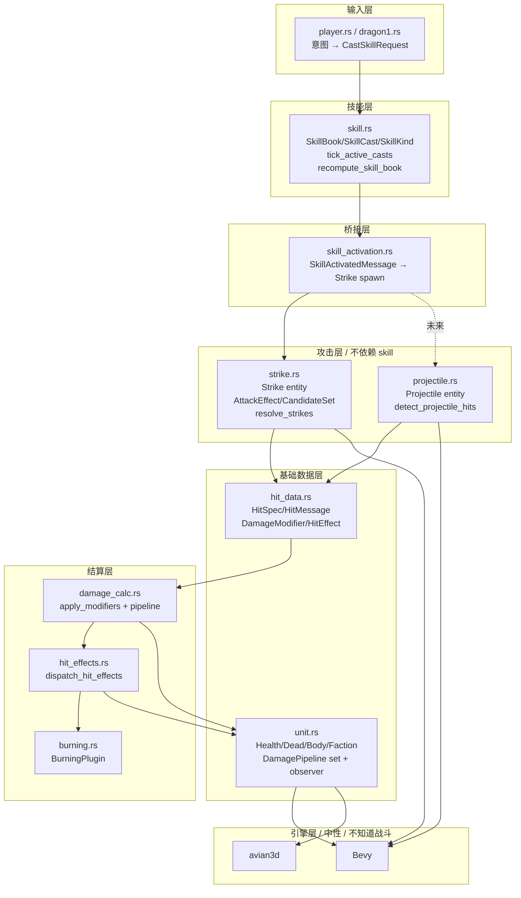

**关键约定**：

- **箭头方向 = 依赖方向**。`strike.rs` 不知道 `skill_activation.rs` 存在 —— 桥接层是上游。
- **`hit_data.rs` 是产源 / 结算共用 vocabulary** —— 双向都引但模块本身不引任何业务模块。
- **`unit.rs` 是 `DamagePipeline` set 的拥有者**，所有结算 plugin 都把 system 塞进这里定义的 set。但 unit.rs 不引任何 plugin 模块（plugin 反过来引 unit.rs 的 set 枚举）。
- **`SkillActivationPlugin` 桥接是唯一同时知道 skill / strike 两个域的模块** —— 这是有意的"翻译节点"。

---

## 14. 扩展配方（按改动量从小到大）

### 14.1 加新 `HitEffect` variant

**改动**：

1. `hit_data.rs` 加 enum variant
2. `hit_effects.rs` `match` 里加 arm

**不动**：modifier 流水线、strike、projectile、skill 都不需要改 —— effect 是 caster 在 `HitSpec.effects` 里塞进去的、跟产源解耦。

### 14.2 加新 `DamageModifier` variant

**改动**：

1. `hit_data.rs` 加 enum variant
2. `damage_calc.rs::apply_modifiers` 里加 `match` arm

**不动**：strike / projectile / skill。caster-side modifier 由 `recompute_skill_book` 烧入；目标侧 modifier 在 `apply_modifiers` 跑完 caster-side 之后 apply（target-side 接口待加）。

### 14.3 加新 `SkillKind` / `SkillEffectKind`

**改动**：

1. `skill.rs::SkillKind` 加 variant
2. `skill.rs::SkillBookDefaults` 给该 variant 配 `Skill { windup, active, recovery, ... }` + `SkillEffectKind`
3. `skill_activation.rs` `match` 加 arm（翻译成 `Strike` / `Projectile` spawn）
4. 动画层：若需要新动画，`PlayerAction` 加 variant + `active_frames`
5. 输入层：`player.rs` / `dragon1.rs` 加触发逻辑

**不动**：damage_calc / hit_effects / strike 几何 / projectile。

### 14.4 加新 `AttackEffect` variant（攻击层新形状）

> 例：`MeleeSector { reach, sector }` —— "正面 90° 锥形扫"

**改动**：

1. `strike.rs::AttackEffect` 加 variant
2. `strike.rs::judge_hits` 派发 + 实现 `judge_sector_in_circle`（或类似）
3. `skill_activation.rs` 翻译某个 `SkillEffectKind` 到这个 variant
4. （单测：在 strike.rs 里补 judge 测试）

**不动**：damage_calc / hit_effects / skill 数值表。

### 14.5 加新 `CandidateSet` variant

> 例：`InFaction(FactionGroup)` —— 联机时多派系协作

**改动**：

1. `strike.rs::CandidateSet` 加 variant
2. `admits(Faction)` 加 match arm
3. `skill_activation.rs` 决定何时构造这个 variant

**不动**：judge 几何流程（all judge_* 都通过 `is_valid_candidate` 调 `admits`）。

### 14.6 加新 caster-side 数据源

> 例：`WeaponMul`（独立于 `Strength` 的武器倍率）

**改动**：

1. `unit.rs` / 装备模块加 `WeaponMul` 组件
2. `recompute_skill_book` 的 query filter 改 `Or<(Changed<Strength>, Changed<WeaponMul>, Changed<SkillKindSet>)>`
3. `apply_strength` 内部读 `WeaponMul`，prepend 多一个 `DamageModifier::Mul`

**不动**：damage_calc 不变（modifier 链跟以前一样跑）。

### 14.7 加新 DoT debuff

> 例：`Poison { dps, stacks }`

**改动**：

1. 新文件 `unit/poison.rs`：`Poison` 组件 + `tick_poison` system 塞进 `DamagePipeline::PersistentEffects`
2. `unit/hit_effects.rs::HitEffect` 加 `Poison { ... }` variant
3. `dispatch_hit_effects` 派发到 "插入 Poison 组件" 的 action
4. `lib.rs` 注册 `PoisonPlugin`

**不动**：strike / projectile / damage_calc / skill。新模块完全独立。

---

## 15. 当前简化（已知占位 / TODO）

> 知道这些"看起来 ad-hoc"的地方是有意为之 —— 等需求落地再回头补。

| 简化点 | 当前 | 何时换 |
|---|---|---|
| **caster-side modifier 只读 `Strength`** | `apply_strength` prepend `Mul(strength)` | 加装备 / 武器 buff 时扩展 `recompute_skill_book` |
| **target-side modifier 未接** | `calc_damage_pipeline` 有占位注释 | 加 `Armor` / `Vulnerable` 时在 `apply_modifiers` 后追加一段 |
| **`Faction` 二元** | `Player` / `Enemy` | 召唤物倒戈 / 多派系联机时换 `(group_id, mood)` |
| **`SkillKind` 单 variant** | `BasicMeleeSlash` | 加新技能时直接补 variant + 数值表 |
| **`AttackEffect` 三 variant** | `SingleTarget` / `MeleeReach` / `Aoe` | 加扇形 / 直线投射时扩展 |
| **`CandidateSet::Hostile` 一律用** | bridge 写死 | SkillBook 带 candidates 字段时改一行 |
| **`HitEffect::Knockback` / `Stun`** | 占位 enum variant，dispatch 里 `// TODO` | 接 movement / impulse / AI 输入禁用时填实现 |
| **技能不可被打断** | `SkillCast` 没有"被命中→中断"逻辑 | 加 hyperarmor / poise 系统时加 cancel 流程 |
| **没有连段 / combo** | 一次 cast 一次 strike entity | 加多段攻击时让 `SkillCast` 状态机有多个 active 窗口 |
| **没有 cooldown 共享 / 资源消耗** | `SkillBook` 只有冷却 | 加蓝条 / 怒气时在 `CastSkillRequest` handler 里扣 |
| **RNG 用 `fastrand`** | 无状态全局 RNG | 联机 / replay 时换 `Resource<DamageRng>` |
| **没有玩家 vs 玩家** | 单机自动战斗 | 暂无计划 |

---

## 16. 一行总结

> **状态机管节奏（skill）→ 桥接翻译（skill_activation）→ 攻击层产命中（strike/projectile）→ 结算流水线（damage_calc → hit_effects → burning）→ 死亡转移（transition_to_dead）**，五段串成 `DamagePipeline.chain()`，每段只看 message 不看来源 entity。

Caster-side 修正 spawn 时烧入、target-side 修正结算时再读、副作用看 modifier 跑完的中间值；命中产源（Strike / Projectile）发同样的 `HitMessage`，下游一视同仁；`Dead` marker + `Body` observer 让"死了 / 复活"= 状态转移而不是 spawn / despawn。
